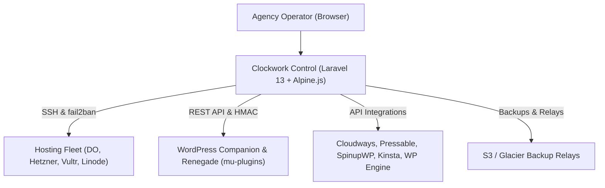

# Developer Onboarding & Architecture Playbook

Welcome to Clockwork Control! This guide is designed to get any new or returning engineer up to speed in minutes, understand how the pieces connect, and write clean, safe, high-velocity code.

---

## 1. System Architecture at a Glance

Clockwork Control is a 3-tier fleet control plane built for WordPress agencies:



1. **Control Web Application**: High-performance Laravel 13 running on PHP 8.4, with Tailwind CSS v4, Vite, and modular Alpine.js components.
2. **Fleet Bridge**: Direct SSH orchestration for server health, package updates, Nginx log tailing, and automatic fail2ban IP jail drops.
3. **Agent Ecosystem**: Proprietary WordPress `mu-plugins` (Companion & Renegade) that report site health, execute remote lockouts, and sync configuration securely via cryptographic HMAC tokens.

---

## 2. Directory Structure & Where Things Live

```text
clockwork-control/
├── app/
│   ├── Console/Commands/      # Scheduled ingest & maintenance loops
│   ├── Http/Controllers/      # Thin HTTP request handlers
│   ├── Models/                # Eloquent models with strict docblocks & scopes
│   └── Services/              # Domain logic (SSH, security, uptime, cloud APIs)
├── modules/                   # 32 modular packages (Core + 31 provider & feature packages)
│   ├── Core/                  # Shared base classes, contracts, and manifests
│   ├── Gatekeeper/            # Native brute-force defense & fail2ban bridge
│   ├── BackupRelay/           # Off-site backup relay to S3/Glacier
│   └── [Providers]/           # DigitalOcean, Hetzner, Pressable, SpinupWP, etc.
├── resources/
│   ├── css/app.css            # Tailwind CSS design system tokens
│   ├── js/
│   │   ├── app.js             # Lean entry point booting Alpine & system services
│   │   ├── components/        # Isolated, typed Alpine components
│   │   ├── charts/            # ECharts loaders & interactive charts
│   │   ├── system/            # Chrome, theme, font-scale, quick-jump
│   │   └── types/             # TypeScript interfaces & global window definitions
│   └── views/
│       ├── components/        # Reusable Blade UI primitives (<x-card>, <x-status-pill>)
│       ├── dashboard/         # Fleet management views
│       └── layouts/           # Master application layouts
└── tests/
    ├── Feature/               # End-to-end integration & architecture tests
    └── Unit/                  # Fast domain unit tests
```

---

## 3. Developer Commands & Quality Gates

We use a single-step quality gate to guarantee zero regressions:

| Command | What it does |
|---|---|
| `composer check` | Runs Pint (PHP style), PHPStan, Biome check, and TypeScript typecheck in ~3 seconds. |
| `composer format` | Automatically formats all PHP (Pint) and JS/TS/JSON (Biome). |
| `composer test` | Runs the full Pest test suite (2,300+ tests). |
| `composer gate` | Runs `composer check` + `composer test` before push or PR. |
| `npm run dev` | Runs Vite development server with hot module replacement. |
| `npm run build` | Builds optimized production assets. |

### Pre-Commit Guard
Every commit automatically validates modified files via `.githooks/pre-commit` to prevent syntax errors, type issues, or unformatted code from ever landing in git history.

---

## 4. Frontend Engineering Standards

1. **Zero Inline `<script>` Tags in Blade**:
   - Never write raw `<script>` tags in Blade templates.
   - Extract UI logic into dedicated files under `resources/js/components/` as typed Alpine components.
   - Register components in `resources/js/app.js` via `Alpine.data('name', component)`.
2. **Type Safety & TypeScript**:
   - Component state, method options, and API responses must have TypeScript interfaces.
   - Run `npm run typecheck` (`tsc --noEmit`) to verify types.
3. **Chart Visualizations**:
   - Use native, bundled **ECharts** (`resources/js/charts/`).
   - Never load external CDN scripts (like unpinned Chart.js).
   - Always implement a `destroy()` hook to dispose chart instances and detach resize listeners on view changes.
4. **Use Blade UI Primitives**:
   - Don't copy-paste raw Tailwind utility classes for status badges or cards.
   - Use `<x-status-pill status="success">Active</x-status-pill>`
   - Use `<x-card title="..." icon="...">...</x-card>`
   - Use `<x-stat-box label="..." :value="..." />`

---

## 5. Backend Engineering Standards

1. **Strict Types & Explicit Returns**:
   - New PHP files should declare `declare(strict_types=1);`.
   - Explicitly type all method parameters and returns (`: void`, `: array`, `: Response`).
2. **Model Documentation**:
   - Keep `@property`, `@property-read`, and `@method` tags current on Eloquent models so IDEs and PHPStan have 100% autocompletion.
3. **Fat Controller Prevention**:
   - Controllers should be thin (5–15 lines per action): validate request, invoke a Service or Action, return a view or JSON response.
   - Heavy background jobs or SSH operations belong in `App\Jobs` or `App\Services`.
4. **Architecture Invariants**:
   - Invariants are verified in `tests/Feature/ArchitectureTest.php`.
   - No debug statements (`dd`, `dump`, `ray`, `var_dump`).
   - No direct `env()` calls outside `config/` files.
   - All modules must extend `Modules\Core\ModuleServiceProvider`.
